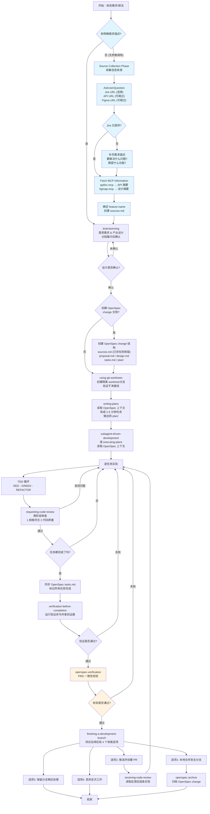
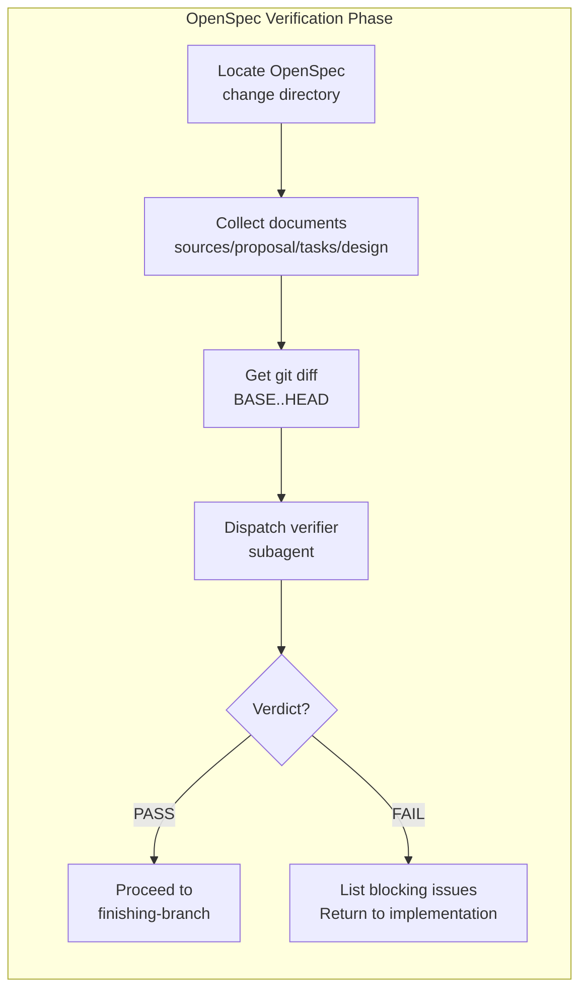

# V3 - OpenSpec Verification Integration



## V3 Changes (OpenSpec Verification Integration)

| Step | Change |
|------|--------|
| openspec-verification | NEW: PRD consistency verification step after verification-before-completion |
| Check Content | Document consistency, PRD completeness, implementation consistency |
| Trigger | Auto in workflow OR `/verify-openspec` manual command |
| Fail Action | Return to implementation phase to fix issues |

## OpenSpec Verification Flow Detail



## Verification Checks

| Check | Description | Pass Criteria |
|-------|-------------|---------------|
| Document Consistency | Compare OpenSpec docs for conflicts | No contradictions between sources/proposal/tasks/design |
| PRD Completeness | Verify all requirements implemented | 100% requirements have code |
| PRD Consistency | Verify implementation matches description | Behavior aligns with PRD |

## OpenSpec Directory Structure (V3)

```
openspec/changes/<feature-name>/
├── sources.md       # Information sources and PRD (from source collection)
├── proposal.md      # Why we're doing this (OpenSpec standard)
├── design.md        # Technical decisions (optional)
├── tasks.md         # High-level task overview
├── plan/
│   └── YYYY-MM-DD-v<N>.md
└── specs/
    └── <spec-name>/
        └── spec.md
```

## Comparison: V2 vs V3

| Aspect | V2 | V3 |
|--------|----|----|
| Pre-completion check | verification-before-completion only | verification-before-completion + openspec-verification |
| PRD alignment | Not verified | Verified by subagent |
| Document consistency | Not checked | Checked across all OpenSpec docs |
| Manual trigger | N/A | `/verify-openspec` command |

## Version History

| Version | Key Changes |
|---------|-------------|
| V1 | Original workflow |
| V2 | Added Source Collection Phase |
| V3 | Added OpenSpec Verification step |
